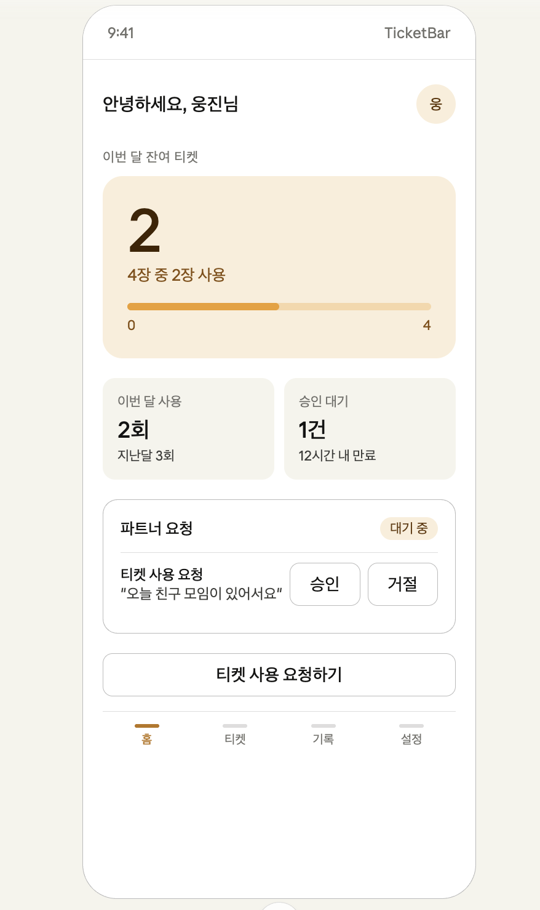
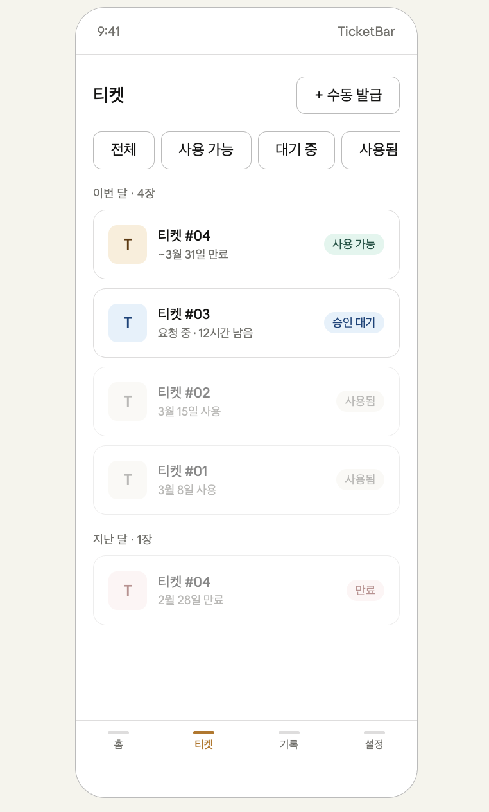
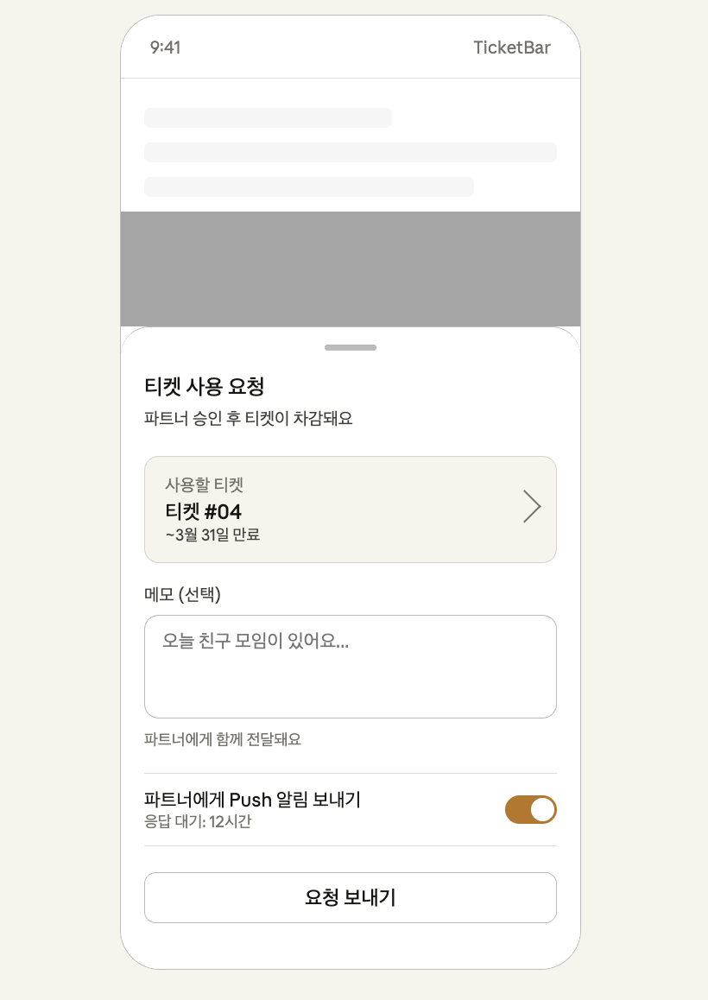
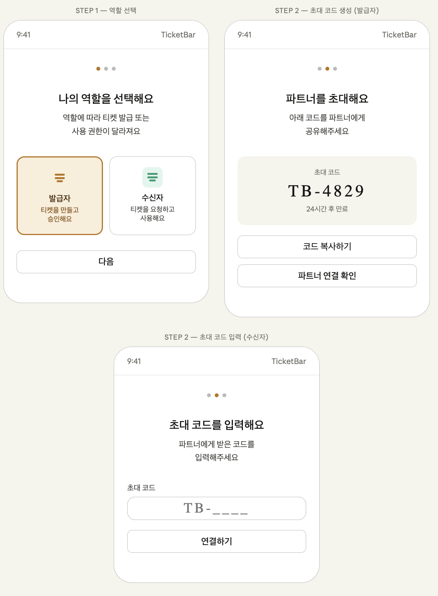
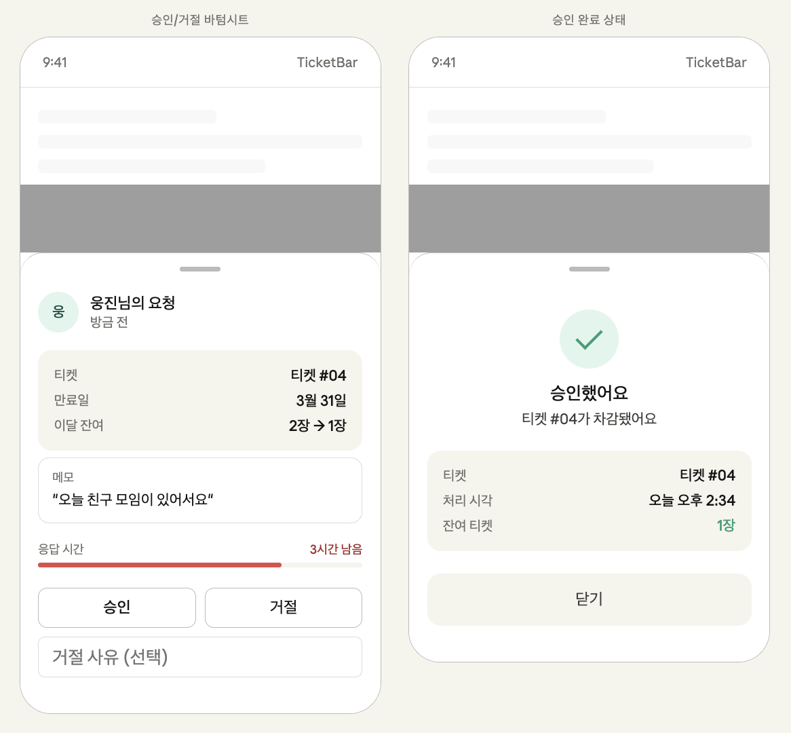

# TicketBar — 와이어프레임

> 스크린샷은 `docs/images/` 폴더에 추가 예정

---

## 화면 목록

| 화면 | 경로 | 이미지 |
|------|------|--------|
| 홈 | `/home` |  |
| 티켓 목록 | `/tickets` |  |
| 티켓 사용 요청 바텀시트 | `/home` (바텀시트) |  |
| 온보딩 | `/onboarding` |  |
| 승인/거절 바텀시트 | `/home` (바텀시트) |  |

---

## 화면별 설계 포인트

### 홈 (`/home`)

**구성 요소**
- 상단: 유저 이름 인사 + 아바타
- 히어로 카드: 이번 달 잔여 티켓 수 (대형 숫자) + 프로그레스 바
- 요약 스탯: 이번 달 사용 횟수 / 승인 대기 건수
- 파트너 요청 카드: 대기 중인 요청 + 승인/거절 버튼 인라인 노출
- CTA 버튼: "티켓 사용 요청하기" (receiver 전용)

**설계 포인트**
- 파트너 요청이 없을 때는 요청 카드 영역 미노출
- 잔여 티켓 0장일 때 히어로 카드 색상 변경 (경고 톤)
- issuer는 CTA 버튼 대신 "발급 현황 보기" 링크 노출

---

### 티켓 목록 (`/tickets`)

**구성 요소**
- 상단: 페이지 타이틀 + 수동 발급 버튼 (issuer only)
- 필터 칩: 전체 / 사용 가능 / 대기 중 / 사용됨 / 만료
- 티켓 카드 목록: 월별 그룹핑
- 각 카드: 티켓 번호 + 만료일 + 상태 배지

**설계 포인트**
- 상태별 색상: 사용 가능(teal) / 대기 중(blue) / 사용됨(gray) / 만료(red)
- 사용됨 / 만료 티켓은 opacity 낮춰서 시각적 구분
- 수동 발급 버튼은 issuer에게만 노출

---

### 티켓 사용 요청 바텀시트

**구성 요소**
- 사용할 티켓 선택 (드롭다운 — 사용 가능한 티켓 목록)
- 메모 입력 (선택, 파트너에게 전달)
- Push 알림 전송 여부 토글 (기본 ON)
- 응답 대기 시간 안내 텍스트
- "요청 보내기" 버튼

**설계 포인트**
- 사용 가능한 티켓이 없으면 바텀시트 진입 불가 + 안내 문구
- 요청 전송 후 홈 화면 요약 스탯 실시간 업데이트 (Supabase Realtime)

---

### 온보딩

**Step 1 — 역할 선택**
- 발급자 / 수신자 카드 선택 UI
- 각 역할의 권한 간단 설명

**Step 2 — 초대 코드 (issuer)**
- 생성된 코드 대형 표시 (모노스페이스 폰트)
- 코드 복사 버튼
- 24시간 만료 안내
- 파트너 연결 확인 버튼 (폴링 or Realtime)

**Step 2 — 초대 코드 입력 (receiver)**
- 코드 입력 필드 (대형, 중앙 정렬)
- "연결하기" 버튼

**설계 포인트**
- 코드 입력 시 실시간 유효성 표시 (4자리 + 형식 체크)
- 잘못된 코드 / 만료된 코드 에러 메시지 명확히

---

### 승인/거절 바텀시트 (issuer 뷰)

**구성 요소**
- 요청자 정보 (아바타 + 이름 + 요청 시각)
- 요청 상세 카드: 티켓 번호 / 만료일 / 차감 후 잔여 티켓
- 메모 말풍선 (요청 메모 표시)
- 타임아웃 진행 바 + 남은 시간
- 승인 / 거절 버튼
- 거절 사유 입력 필드 (선택)

**승인 완료 상태**
- 체크 아이콘 + "승인했어요" 메시지
- 차감 후 잔여 티켓 수 확인
- 닫기 버튼

**설계 포인트**
- 타임아웃이 1시간 이하로 남으면 진행 바 색상 빨간색으로 전환
- 승인/거절 버튼은 실수 방지를 위해 각각 명확한 색상 구분 (teal / neutral)
